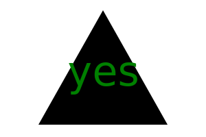
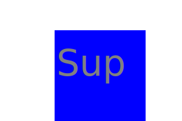

## Description 
Scalable Vector Graphics (SVG) is a XML-based vector image format for defining two-dimensional graphics. As opposed to pixel-based raster files like JPEGs, vector files store images via mathematical formulas based on points and lines on a grid. 

the project consist of a series of questions, from the answers on the questionaire a SVG is made.  

## Generated SVG's

  
 
 


## Table of Contents

* [Description](#description)

* [Technology](#technology)

* [Installation](#installation)

* [Usage](#usage)

* [Test](#test)

* [Credits](#credits)

* [Repo](#repo)


## Technology
packages below are needed to run the application. 

* Inquirer

* Jest

* Javascript

* NPM

* Preview SVG ( optional )

## Installation

* Install and run Nodes

* Install live server to check svg

## Usage
To run the application enter the command in bash 

[Video demo](https://drive.google.com/file/d/1mwhkOd7K3B6UTr4oWAm9LotKIcY9Kp32/view)


```bash
node index.js
```

## Test

[Test demo](https://drive.google.com/file/d/1HSEBzK-kstQBbCEKVJFIH0YPSr3BaI0P/view)

To run the tests enter the command in bash 
```
Npm run test
```

## Credits

BCS Learning Assistant


## Repo

[Github](https://jif945.github.io/Logo/)


## License
